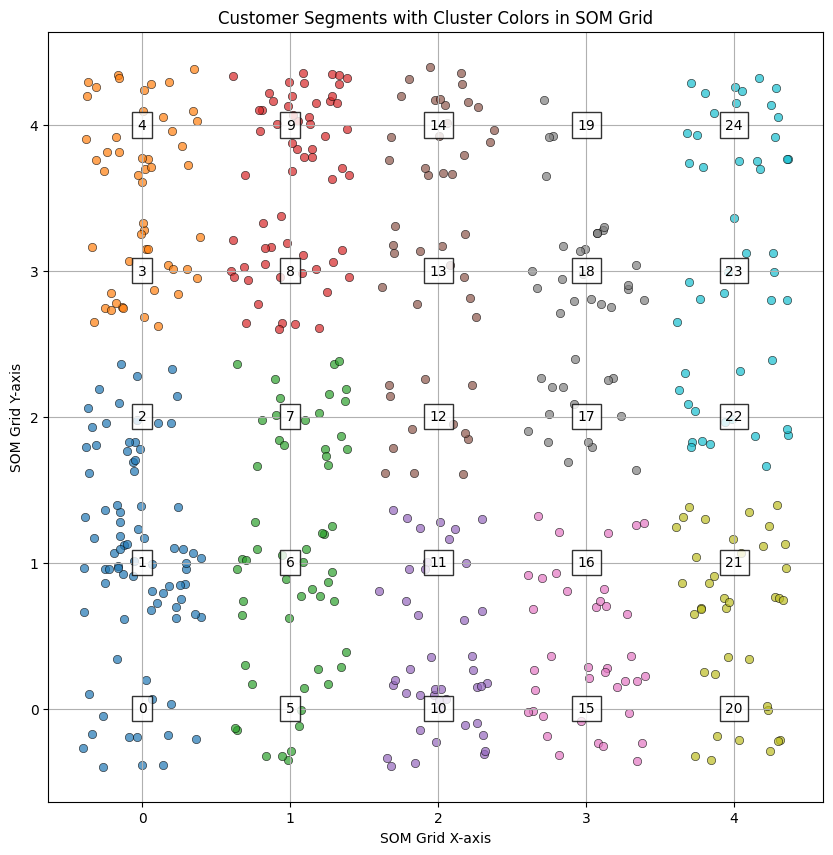

# Self Organizing Map
## Makszim Balázs Imre - ENSGO3

## Introduction

A **Self-Organizing Map (SOM)**, also known as a Kohonen network, is a type of artificial neural network designed for unsupervised learning. SOMs are primarily used for clustering and visualizing high-dimensional data in a low-dimensional (typically 2D) map. They are widely applied in fields like data mining, pattern recognition, and exploratory data analysis.

## Key Characteristics of SOMs:
1. **Unsupervised Learning**: They do not require labeled data; instead, they organize and cluster input data based on inherent patterns or similarities.

2. **Topology Preservation**: SOMs maintain the spatial relationship of the data. Input data points that are similar are mapped to nearby nodes in the SOM, preserving their topological structure.

3. **Dimensionality Reduction**: They reduce high-dimensional data into a two-dimensional map, making complex data easier to interpret and visualize.

## Structure of a SOM:

1. **Input Layer**: Consists of feature vectors from the dataset.

2. **Output Layer (Map)**: A grid of neurons (nodes), typically arranged in a 2D lattice. Each node has an associated weight vector of the same dimension as the input vectors.

## How SOMs Work:

1. **Initialization**: Each node in the output layer is initialized with a random weight vector.

2. **Training**:
    - **Input Data Presentation**: A sample input vector is presented to the network.
    - **Best Matching Unit (BMU)**: The node with the weight vector closest to the input vector (in terms of Euclidean distance) is identified.
    - **Weight Update**: The BMU and its neighbors update their weights to become more like the input vector. The degree of adjustment is controlled by a *learning rate* and *neighborhood function*, which decrease over time.

3. **Convergence**: After multiple iterations, the nodes organize themselves so that similar input vectors are mapped to adjacent nodes.

---

_*Learning Rate Decay_: Ensures the SOM converges over time.

_*Neighborhood Function_: Controls how far the influence of a BMU extends to its neighbors.

## Applications of SOMs:

1. **Clustering**: Grouping similar data points, such as customer segmentation.

2. **Data Visualization**: Representing high-dimensional data on a 2D map (e.g., in bioinformatics).

3. **Anomaly Detection**: Identifying data points that don’t fit into existing clusters.

4. **Feature Reduction**: Simplifying datasets for further processing.

# Implementation

## Overview

This implementation segments a set of synthetic customer data into clusters using a Self-Organizing Map (SOM).

## Example: Customer Segmentation in an Online Store

### Task:

An online store owner wants to understand how their customers can be grouped (segmented) based on their purchasing behavior. The data includes the following:

- Purchase frequency.
- Average spending.
- Product categories they purchase from.
- Customers' demographic information (e.g., age, gender).

### Using SOM:

**Data Preparation**:
- Customer data is represented in a multi-dimensional space (e.g., 10 dimensions), where each dimension corresponds to one of the listed features.

**Training the SOM**:
- A SOM is trained on a 10x10 grid to learn the structure of the data.
- Customers with similar purchasing behaviors are mapped close to each other on the grid.

**Identifying Clusters**:
- Customers are grouped into different clusters on the SOM grid.
- For example, customers could be segmented into the following groups:
    - Low-spending, infrequent buyers.
    - High-spending, frequent buyers.
    - Customers focusing on a specific product category.

**Supporting Business Decisions**:
- Segments enable the creation of personalized marketing campaigns:
    - Offer discounts to low-spending customers.
    - Create VIP programs for frequent buyers.

## Detailed explanation of the implementation:

### Step 1: Generate Synthetic Data

```python
np.random.seed(42)
num_customers = 500
data = np.column_stack((
    np.random.poisson(lam=5, size=num_customers),         # Purchase frequency
    np.random.normal(loc=100, scale=20, size=num_customers),  # Average spending
    np.random.randint(1, 5, size=num_customers),          # Category focus (1-4)
    np.random.randint(18, 65, size=num_customers)         # Age
))
```
**Explanation**:
- This code generates a set of random input data.

**Inputs**:
- Customer behavior: `purchase_frequency`, `avg_spending`, `category_focus`, `age`.

**Outputs**:
- A matrix (`data`) of shape `(500, 4`) representing 500 customers with 4 features.

### Step 2: Normalize the Data

```python
scaler = MinMaxScaler()
data_normalized = scaler.fit_transform(data)

```
**Explanation**:
- Normalizes all features to the range [0,1], ensuring that all dimensions contribute equally to the Euclidean distance calculation.

**Formula**:
```math
X_{norm} = \frac{X - X_{min}}{X_{max} - X_{min}}
```

### Step 3: Initialize SOM Parameters

```python
som_grid_size = (5, 5)  # SOM grid size
weights = np.random.rand(som_grid_size[0], som_grid_size[1], data_normalized.shape[1])  # Randomly initialized weights
sigma = 2.0  # Neighborhood radius
learning_rate = 0.5
num_iterations = 1000
```

**Explanation**:

- **Grid size:** 5x5 SOM grid.
- **Weights:** Randomly initialized weight vectors for each SOM node.
- **Sigma (σ):** Initial neighborhood radius.
- **Learning rate (η):** Controls weight updates.

### Step 4: Train the SOM
```python
for iteration in range(num_iterations):
    # Randomly select a sample
    sample = data_normalized[np.random.randint(0, data_normalized.shape[0])]

    # Find Best Matching Unit (BMU)
    distances = np.array([[euclidean_distance(sample, weights[i, j])
                           for j in range(som_grid_size[1])] for i in range(som_grid_size[0])])
    bmu_index = np.unravel_index(np.argmin(distances), distances.shape)

    # Update weights of BMU and its neighbors
    for i in range(som_grid_size[0]):
        for j in range(som_grid_size[1]):
            distance_to_bmu = euclidean_distance(np.array([i, j]), np.array(bmu_index))
            if distance_to_bmu < sigma:
                influence = np.exp(-distance_to_bmu**2 / (2 * sigma**2))
                weights[i, j] += learning_rate * influence * (sample - weights[i, j])

    # Decay learning rate and neighborhood size
    learning_rate *= 0.99
    sigma *= 0.99

```

**Explanation**:
1. **Random Sample**: A data point is randomly selected.
2. **Best Matching Unit (BMU)**:
- The SOM node (grid point) whose weight vector is closest to the sample is selected.
- Formula (Euclidean distance):

```math
d_{ij} = \| x - w_{ij} \|_2 = \sqrt{\sum_k (x_k - w_{ij,k})^2}
```

3. **Neighborhood Update**:
- Update weights of the BMU and its neighbors:
```math
w_{ij} \gets w_{ij} + \eta \cdot \text{influence} \cdot (x - w_{ij})
```
- Influence is determined by a Gaussian function:
```math
\text{influence} = \exp\left(-\frac{d_{\text{BMU}}^2}{2\sigma^2}\right)
```

4. **Decay Parameters**:
Gradually reduce the learning rate (η) and neighborhood size (σ) over iterations.

### Step 5: Assign Customers to Clusters

```python
customer_clusters = np.array([
    np.unravel_index(np.argmin([[euclidean_distance(customer, weights[i, j])
                                 for j in range(som_grid_size[1])] for i in range(som_grid_size[0])]), weights.shape[:2])
    for customer in data_normalized
])
```

**Explanation**:
- For each customer, find the BMU (i.e., the SOM node with the smallest distance to the customer's normalized data vector).
- Assign the customer to the BMU's cluster.

### Step 6: Visualize the Clusters

```python
unique_clusters = np.unique(customer_clusters, axis=0)
unique_cluster_indices = {tuple(cluster): idx for idx, cluster in enumerate(unique_clusters)}
cluster_colors = np.array([unique_cluster_indices[tuple(c)] for c in customer_clusters])

```

**Explanation**:
- Identify unique clusters (grid points) and assign a unique color to each.

### Step 7: Plot SOM Grid

```python
plt.figure(figsize=(10, 10))
for i, (x, y) in enumerate(customer_clusters):
    plt.scatter(
        x + np.random.uniform(-0.4, 0.4),
        y + np.random.uniform(-0.4, 0.4),
        color=color_map(cluster_colors[i]),
        alpha=0.7,
        edgecolors="k",
        linewidth=0.5
    )

for idx, cluster in enumerate(unique_clusters):
    plt.text(cluster[0], cluster[1], str(idx), ha='center', va='center',
             bbox=dict(facecolor='white', alpha=0.8, edgecolor='black'))

plt.title("Customer Segments with Cluster Colors in SOM Grid")
plt.xlabel("SOM Grid X-axis")
plt.ylabel("SOM Grid Y-axis")
plt.grid()
plt.show()

```



**How to Interpret the Diagram?**
- Customers belonging to the same grid point (or close points) have similar purchasing habits.
- Clusters with different colors and further apart indicate greater differences in purchasing behavior.

**Explanation**:
- **Scatter Plot**: Customers are visualized on the SOM grid, grouped by their assigned clusters.
- **Cluster Labels**: Unique labels are added to the grid nodes to identify clusters.

## Summary

1. The SOM projects high-dimensional customer data into a 2D grid.
2. Similar customers are mapped to the same or neighboring grid points, forming clusters.
3. The resulting grid visually represents customer segments, which can be analyzed for targeted marketing.